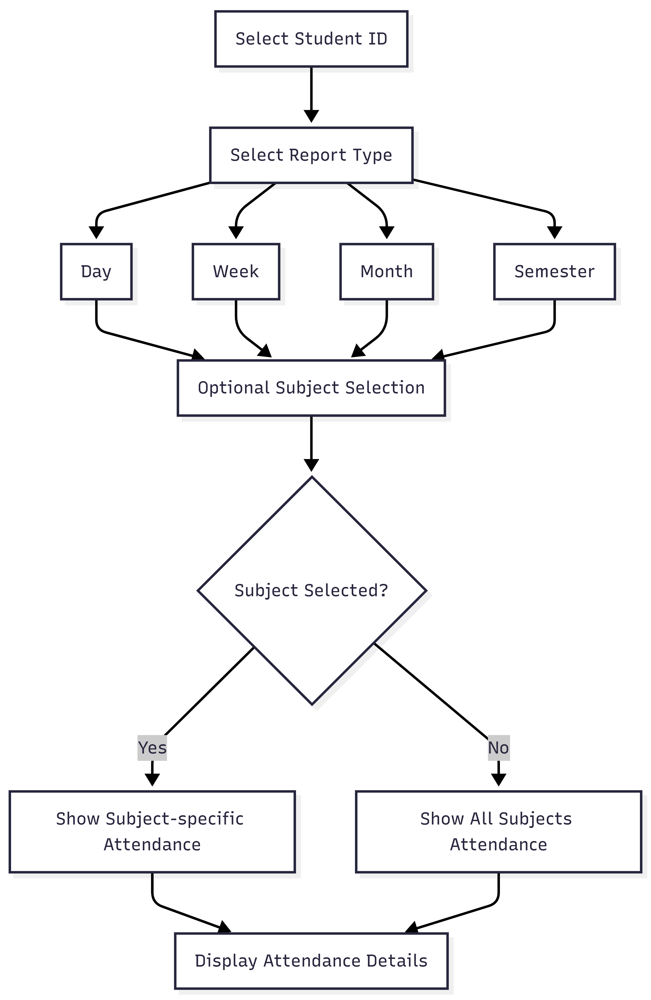
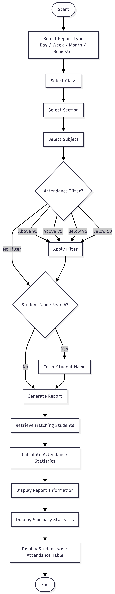
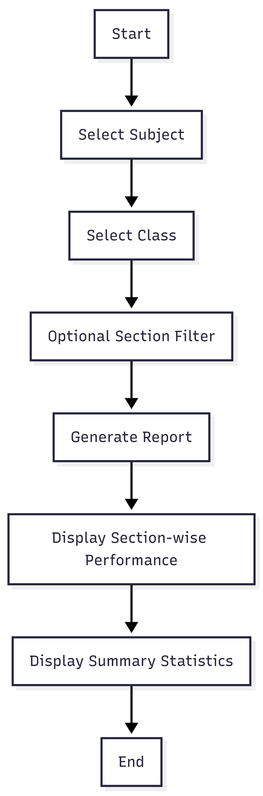
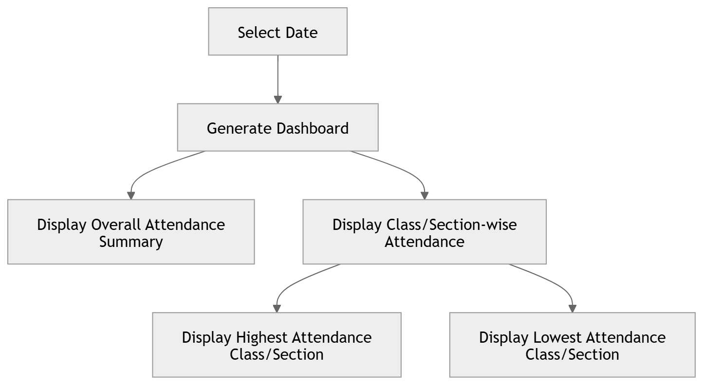

# Post-Attendance Report
 
## Overview
Once attendance is completed, the system should display a concise report with the following details:
 
- **Total Enrolled Students**: The total number of students registered in the class or section.
- **Number of Students Present**: The count of students who were present in that session.
- **Number of Students Absent**: The count of students who were absent in that session.
- **List of Absent Students**: Names of all students who were absent in that session.
 
## Example Report
 
- **Total Enrolled**: 30
- **Present**: 27
- **Absent**: 3
- **Absent Students**:
  - Alice Johnson
  - Mark Smith
  - Priya Kumar
## Workflow Diagram

# Student Attendance Report

## Overview

This report focuses on a specific student. After selecting a Student ID, the system allows the user to generate attendance reports for a selected time period (**Day**, **Week**, **Month**, or **Semester**).

The report can optionally be filtered by subject.

---

## Steps

### 1. Select Student ID

The user selects a student using their unique **Student ID**.

### 2. Select Report Type

Choose one of the following:

- Day
- Week
- Month
- Semester

### 3. Optional Subject Selection

- If a subject is selected, the report displays attendance only for that subject.
- If no subject is selected, the report displays attendance across all enrolled subjects.

---

## Output Details

### Student Information

- Student ID
- Student Name
- Class
- Section

### Attendance Information

For each subject (or selected subject):

- Total Classes Conducted
- Classes Attended
- Classes Absent
- Attendance Percentage

### Overall Summary

- Overall Attendance Percentage
- Total Classes Conducted
- Total Classes Attended
- Total Classes Absent

---

## Example Report

### Filters

- **Student ID:** 12345
- **Report Type:** Semester
- **Subject:** All Subjects

### Student Details

- **Student ID:** 12345
- **Name:** John Doe
- **Class:** 10
- **Section:** A

### Subject-wise Attendance

| Subject | Total Classes | Classes Attended | Classes Absent | Attendance % |
|----------|--------------|------------------|----------------|--------------|
| Maths | 40 | 36 | 4 | 90.0% |
| Science | 38 | 35 | 3 | 92.1% |
| English | 42 | 39 | 3 | 92.9% |

### Overall Attendance

- **Total Classes Conducted:** 120
- **Total Classes Attended:** 110
- **Total Classes Absent:** 10
- **Overall Attendance Percentage:** 91.67%

## Workflow Diagram

# Class-Wise Subject Attendance Query Report

## Overview

This report allows teachers and administrators to view attendance statistics for all students in a selected class, section, and subject.

The report can be generated for a specific **Day**, **Week**, **Month**, or **Semester**.

---

## Filters

### Report Type

- Day
- Week
- Month
- Semester

### Mandatory Filters

- Class
- Section
- Subject

### Optional Filters

#### Attendance Percentage Range

- Above 90%
- Above 75%
- Below 75%
- Below 50%

#### Student Name Search

- Search by student name

---

## Steps

### 1. Select Report Type

Choose one of:

- Day
- Week
- Month
- Semester

### 2. Select Class

Example:

- Class 10

### 3. Select Section

Example:

- Section A

### 4. Select Subject

Example:

- Mathematics

### 5. Apply Optional Filters

- Attendance Percentage Range
- Student Name Search

### 6. Generate Report

The system displays attendance information for all students matching the selected filters.

---

## Output Details

### Report Information

- Report Type
- Class
- Section
- Subject

### Summary Statistics

- Total Students
- Average Attendance Percentage
- Highest Attendance Percentage
- Lowest Attendance Percentage

### Student-wise Attendance

| Student ID | Student Name | Classes Conducted | Classes Attended | Classes Absent | Attendance % |
|------------|-------------|-------------------|------------------|----------------|--------------|
| 101 | Alice Johnson | 20 | 18 | 2 | 90% |
| 102 | Mark Smith | 20 | 16 | 4 | 80% |
| 103 | Priya Kumar | 20 | 19 | 1 | 95% |

---

## Example Report

### Filters

- **Report Type:** Month
- **Class:** 10
- **Section:** A
- **Subject:** Mathematics
- **Attendance Percentage Range:** Above 75%

### Summary

- **Total Students:** 30
- **Average Attendance Percentage:** 86.5%
- **Highest Attendance Percentage:** 98%
- **Lowest Attendance Percentage:** 62%

### Student-wise Attendance

| Student ID | Student Name | Classes Conducted | Classes Attended | Classes Absent | Attendance % |
|------------|-------------|-------------------|------------------|----------------|--------------|
| 101 | Alice Johnson | 20 | 18 | 2 | 90% |
| 102 | Mark Smith | 20 | 16 | 4 | 80% |
| 103 | Priya Kumar | 20 | 19 | 1 | 95% |

## Workflow Diagram

# Subject Performance Dashboard

## Overview

This report shows attendance performance for a selected subject across all sections of a class.

It helps HODs, coordinators, and administrators compare attendance trends between sections of the same class.

---

## Filters

### Mandatory

- **Report Type**
  - Day
  - Week
  - Month
  - Semester

- **Subject**

- **Class**

### Optional

- **Section**

---

## Steps

### 1. Select Report Type

Choose one of:

- Day
- Week
- Month
- Semester

### 2. Select Subject

Example:

- Mathematics

### 3. Select Class

Example:

- Class 10

### 4. Optionally Select a Section

Example:

- Section A

### 5. Generate Report

The system displays attendance performance statistics based on the selected filters.

---

## Output Details

### Summary Statistics

- Average Attendance Percentage
- Highest Attendance Section
- Lowest Attendance Section

### Section-wise Performance

| Section | Attendance % |
|----------|-------------|
| A | 91% |
| B | 85% |
| C | 88% |

---

## Example Report

### Filters

- **Report Type:** Month
- **Subject:** Mathematics
- **Class:** 10

### Summary

- **Average Attendance:** 88%
- **Highest Attendance Section:** A (91%)
- **Lowest Attendance Section:** B (85%)

### Section-wise Breakdown

| Section | Attendance % |
|----------|-------------|
| A | 91% |
| B | 85% |
| C | 88% |

---

## Workflow Diagram

# Daily Attendance Summary Dashboard

## Overview
Provides a college-wide attendance summary for a selected day.

---

## Filters

- Date

## Output

## Summary

- Total Students
- Present Students
- Absent Students
- Overall Attendance Percentage

---

## Class/Section-wise Attendance

| Class     | Section | Attendance % |
|----------|--------|--------------|
| 1st Year | A      | 92%          |
| 1st Year | B      | 88%          |
| 2nd Year | A      | 90%          |

---

## Highlights

- Highest Attendance Class/Section  
- Lowest Attendance Class/Section
  
## Workflow Diagram

