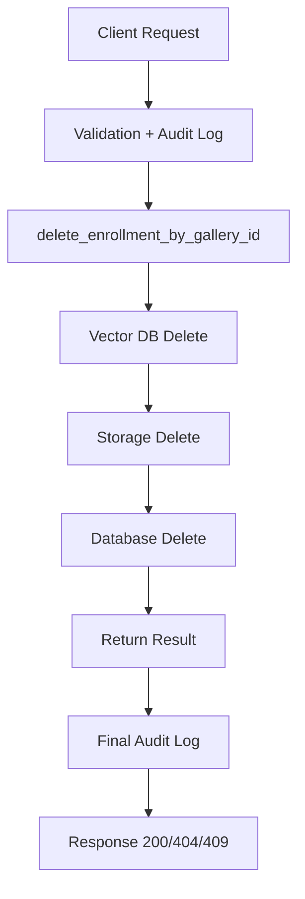

# DELETE /metadata/delete/ - Delete Biometric Enrollment

## 1. Client Request

```http
DELETE /metadata/delete/

{
  "galleryId": "12345"
}
```

## 2. API Entry Point

```python
def delete(self, request):
```

### 2.1 Log Request
```python
logger.info("Delete request received - gallery_id: %s", request.data.get("galleryId"))
```

### 2.2 Audit Log (Before Deletion)
```python
log_audit_event(
    event_type=BIOMETRIC_DELETE,
    action="delete_biometric",
    resource_id=galleryId,
    request=request
)
```
**Purpose**: Records that a delete request was initiated.

### 2.3 Input Validation
```python
serializer = MetadataDeleteReqSerializer(data=request.data)
```
- **Invalid input** → Return `400 BAD REQUEST`

---

## 3. Core Deletion Logic

```python
deletion_result = delete_enrollment_by_gallery_id(gallery_id)
```

### Inside `delete_enrollment_by_gallery_id(gallery_id)`

#### 3.1 Check Record Exists
```python
metadata = Metadata.objects.filter(gallery_id=gallery_id).first()
```
- **Not found** → Return `{"found": False}`

#### 3.2 Vector DB Deletion (First)
```python
vector_success = vector_db.delete_biometric(gallery_id, bio_type)
```
**Purpose**: Deletes embedding from the vector database (search system).

- **Failure** → Return `{"error": "Vector deletion failed; metadata retained"}` (stops here)
#### 3.2.1 Inside `delete_biometric(gallery_id, bio_type)`

**Purpose**: Deletes biometric vectors/embeddings from Milvus.

##### Step 1: Determine Collection

```python
collection_name = self._get_collection_name(
    bio_type,
    gallery_id=gallery_id
)
```

* Determines which Milvus collection contains the vectors.
* Returns False if the biometric type is invalid.

##### Step 2: Build Collection List

```python
collections_to_try = [collection_name]
```

For FID, legacy collections may also be added:

```python
custom_vc = self._metadata_vector_collection(gallery_id)
```

This supports backward compatibility.

##### Step 3: Iterate Through Collections

```python
for coll in collections_to_try:
```

For each collection:

**Check Collection Exists**

```python
if not self._has_collection(coll):
    continue
```

**Check Gallery Exists**

```python
if not self._gallery_exists_in_collection(
    gallery_id,
    coll
):
    continue
```

##### Step 4: Delete Vectors

```python
deletion_result = self.client.delete_vectors(
    collection_name=coll,
    expr=f'gallery_id == "{gallery_id}"'
)
```

**Purpose**: Removes embeddings from Milvus.  
**Equivalent query**:

```sql

DELETE FROM collection
WHERE gallery_id = '12345';
```

##### Step 5: Return Result

* Returns `True` if:
  * Vector was deleted successfully, or
  * No vector existed for that gallery ID.
* Returns `False` only if an exception occurs.

```python
return True
```

**Exception**:

```python
except Exception:
    return False
```
#### 3.3 Storage Deletion
```python
storage_deleted = storage.delete_file(gallery_id)
```
**Purpose**: Deletes stored biometric files/images.

#### 3.4 Database Deletion
```python
deleted, _ = Metadata.objects.filter(gallery_id=gallery_id).delete()
```
**Purpose**: Deletes record from PostgreSQL.

#### 3.5 Return Result
```python
return {
    "storage_deleted": storage_deleted,
    "db_deleted": deleted > 0,
    "vector_db_deleted": vector_success
}
```

---

## 4. API Layer - Post Deletion

### 4.1 Record Not Found
→ Return `404 NOT FOUND`

### 4.2 Audit Log (Success)
```python
log_audit_event(
    action="delete_completed",
    details=deletion_result
)
```

### 4.3 Success Response (200 OK)

```json
{
  "galleryId": "12345",
  "status": "Deleted",
  "storage_deleted": true,
  "db_deleted": true,
  "vector_db_deleted": true
}
```

### 4.4 Consistency Check
- If DB deletion failed → Return `409 CONFLICT`

---

##Summary


