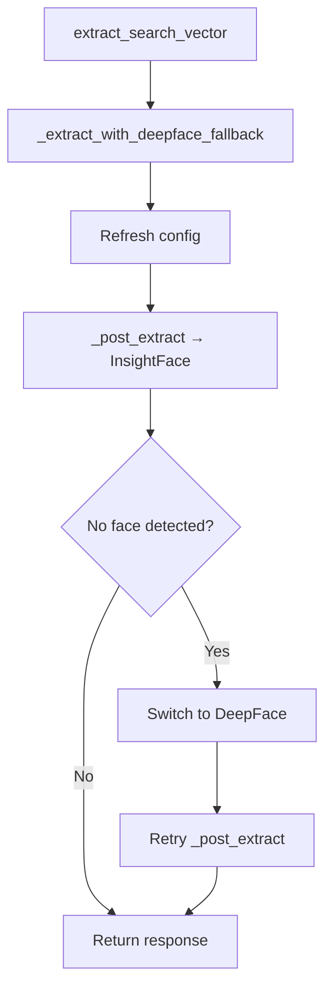

# Face Vector Extraction Flow

## 1. Entry Point

### extract_search_vector()
```python
async def extract_search_vector(self, image_bytes: bytes, sub_type: str) -> dict[str, Any]:
    return await self._extract_with_deepface_fallback(image_bytes, sub_type)
```

**Key idea:**
- Uses fallback mechanism
- Tries InsightFace first
- Falls back to DeepFace if needed

## 2. Main Controller Function
`_extract_with_deepface_fallback()`

```python
async def _extract_with_deepface_fallback(self, image_bytes, sub_type):
```

**Step 1:** Refresh configuration
```python
await sync_to_async(self._maybe_refresh_from_system_configuration, thread_sensitive=True)()
```

**Step 2:** Call primary extractor
```python
primary = self.face_provider
response = await self._post_extract(image_bytes, sub_type)
```

## 3. Fallback Logic (IMPORTANT)

**Condition:**
```python
if (
    not response.get("success", False)
    and primary == "insightface"
    and "no face detected" in (response.get("error") or "").lower()
):
```

If triggered:
```python
logger.warning("InsightFace found no face; retrying with DeepFace")
```

Switch backend:
```python
await sync_to_async(self._apply_backend_routing_sync, thread_sensitive=True)(
    "deepface"
)
```

Retry extraction:
```python
response = await self._post_extract(image_bytes, sub_type)
```

## 4. Actual HTTP Call
`_post_extract()`

```python
async def _post_extract(self, image_bytes, sub_type):
```

**Step 1:** Encode image
```python
image_base64 = base64.b64encode(image_bytes).decode('utf-8')
```

**Step 2:** Build payload
```python
payload = {
    "image_data": image_base64,
    "model_name": self.model_name,
    "parameters": self.extract_params,
}
```

**Step 3:** Send request
```python
async with httpx.AsyncClient(timeout=self.timeout) as client:
    response = await client.post(self.base64_extract_url, json=payload)
```

**Step 4:** Return result
```python
return response.json()
```

## 5. Error Handling

**Timeout**
```python
return {"success": False, "error": "Request timed out"}
```

**GPU / CUDA failure handling**
```python
gpu_detail = parse_gpu_error_from_http(...)
```
Returns structured GPU error:
```python
{
    "error_code": "GPU_EXTRACTOR_UNAVAILABLE",
    "gpu_error": gpu_detail
}
```

**Generic HTTP error**
```python
return {"success": False, "error": f"HTTP {code}: {text}"}
```

## 6. Flow Summary



**Final Output:** Returns the face embedding vector.